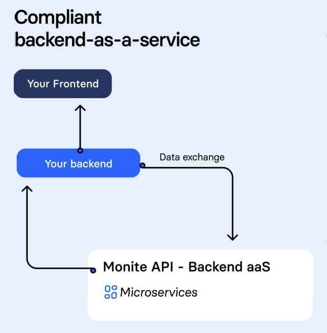

# Monite API overview 

Supercharge your product by embedding multiple finance automation features with a single API. 

How many times have you heard the words, *I love doing invoicing, paperwork is the high point of my day*? In fact the priority of any business is to easily get paid as well as to pay suppliers in time. Make it easy for your clients to spend less time on accounting and paperwork and your satisfied customers increase your revenue.

The number of finance apps is increasing exponentially. Creating software connectors for the main financial services is a large and expensive piece of work. Monite has done the heavy lifting for you. You use the Monite API to easily add invoicing and finance data from multiple sources into your app with a few REST calls. 

Light development work for you, happy customers, increased revenue, not bad. 

## Monite features  

Ok, you have read the marketing words, but what are we really offering? Monite supplies the following features:

- **One place for everything** 

  Forward all upcoming payables to a single email address or upload them directly to Monite with a single REST call. Make another call and you see the document status.

- **Review and approve payables** 
  - Review - invoices are read automatically from most formats. End users easily review and add descriptions to all invoices in the system. 
  - Approve - build custom approval flows based on amount, role, department and more. 
  - Comment - easily add a note, tag another employee or ask for adjustment or clarification.

- **Release payments in one call**
  - Pay - single and bulk payments using cards, virtual cards and transfers. 
  - Reconcile - documents are auto-attached to a transaction.

- **Development solution to fit your needs**
   - White label - get a branded app up and running in 24 hours.
   - Embedded - integrate Monite functionality into your app in 2-4 weeks. 

## How does Monite work?

Monite is a SAAS that your backend securely sends and retrieves financial data to and from using a series of REST calls. Build on a microservice architecture, each endpoint is its own secure service built with full redundancy and failover. 

The business logic objects in Monite are:

- [/v1/incoming_bills](https://monite.stoplight.io/docs/api-docs/b3A6MjU2NTk0MjE-upload-new-bill)

  Manage all your payables in a single endpoint. Upload, update, retrieve and delete invoices singly or in batches. 

- /v1/TBD

  One line explanation encapsulating endpoint functionality.
- /v1/TBD

  One line explanation encapsulating endpoint functionality.

## Start developing

You now know what Monite can do for you, and how it works. It's time to integrate Monite into your app:

* [Get started with the Monite API](b.get-started.md)
* [Implement authentication using Monite API](d.authentication.md)
* TBD
