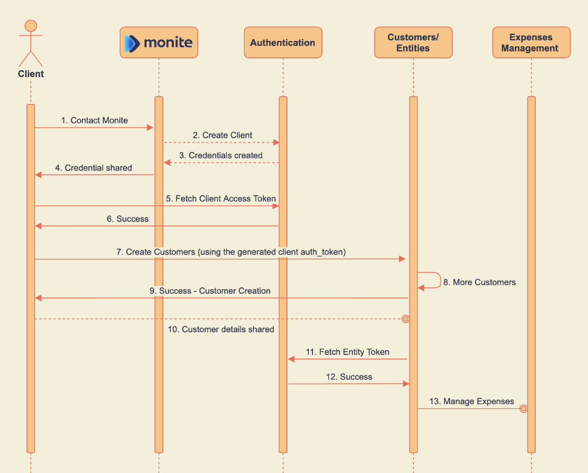

# Get started with Monite API

Monite offers the following development solutions to integrate our functionality into your workflow:

- White label - get a branded app up and running in 24 hours
- Embedded - integrate Monite functionality into your app in 2-4 weeks

This section shows you how to create the [authentication tokens](d.authentication.md) and entities that are the first step for all development solutions. 

## How it works

The following figure shows the API callflow to start managing expenses for your customers. 




## What you need

To successfully understand and complete this task you must have the following:

- A valid Monite account.
- A monite key/value pair.

## Implement your first Monite app

In order to create your first Monite app you need to:

1. **Retrieve API user credentials**

   Get API user key and secret from the Monite. These credentials allow you to get ‘admin’ access to the system.

2. **Create an API user access token**

    Call POST https://api.dev.monite.dev/partner-api/api_users/v1/auth with API user credentials. You will receive an authentication token for all */partner-api/api_users/ resources. These API endpoints will allow you to configure our API according to your business needs.

3. **Map your customers to Monite**

    We have a thing called Entities in our system — a representation of customers of API partners in our system. Customers are either companies (freelancers — businesses) or individuals (persons).

4. **Call POST https://api.dev.monite.dev/partner-api/api_users/v1/entities  to create a new entity**

    ```json
    {
    "name": "Siemens GMBH",
    "type": "business",
    "country_code": "DE"
    }
    
    ```

    This is a minimum payload that sets up a new entity.

5. **Get entity-level access token**

    Entity-level access tokens are related to entities. Each entity has its own tokens. In order to get access to Siemens GMBH  space, we have to get an entity ID of this company and issue a token that is connected to this company.

    POST https://api.dev.monite.dev/partner-api/api_users/v1/entities/{entity_id}/access

6. **Start building your own service**

    These API calls are available on the entity level: Partner Api - ReDoc. For example, you can start implementing an incoming bills feature via our API.

    POST https://api.dev.monite.dev/partner-api/entities/v1/incoming_bills


## Test your app

TBD

## Reference

TBD

    