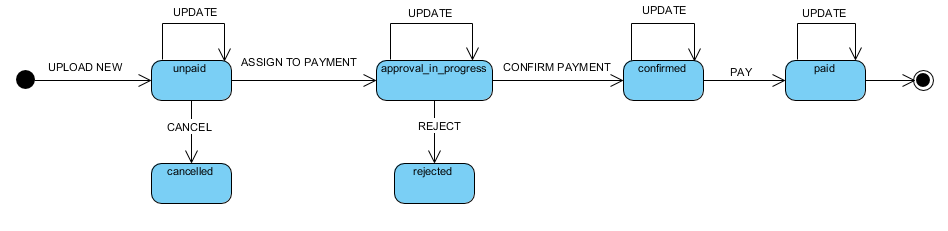

## What is a Payable

Payable is defined as any financial document that is given by an entity's supplier itemizing the purchase of a good or a service and demanding payment. A 'Payable' could in the form of either:

- Bill
- Incoming invoice
- Account Payable document

Monite's platform provides the flexibility both for the *entity* and the *end users of an entity* to manage a payable. However, based on the type of user accessing the respective APIs, there might be certain restrictions which are imposed and controlled by the permissions. This type of flexibility allows the partner to create a funnel/hierarchy of the users.

### 1. Upload a Payable

The **Monite Platform** provides the capability to their users to upload any kind of payable, such as a bill, an invoice or an accounts payable document as described above.

**How to upload as an entity**

Using the access token generated for the entity via the `/partner api/api_users/v1/entities/{entity_id}/access` API, the entity can then submit a payable by using the 

`POST /partner-api/entities/v1/payables`. 

This API successfully submits a payable for an entity. 

**How to upload as an end user of an entity**

A payable - as described above can also be uploaded for clearance & payment, by the end user of an entity. For example, an employee submitting their communication expenses for a payment. Using the API

`POST /partner-api/entities_users/v1/payables`

the entity allows any of it's users to submit such an expense

Upon a successful upload of a payable, the in built OCR reader starts processing and reads the details from the upload. Once the OCR processing is finished, it maps the right information from the payable to the exact column and displays the final result to the user(s). For example, uploading this [bill example](../assets/images/BillExample.pdf) you may get the following response:
```json
{
    "id": "f53f66ee-8ef8-4319-b70b-fcd8e0a6e07f",
    "entity_id": "b0ff50d0-cdea-42fd-9461-1b3799b65bcf",
    "status": "unpaid",
    "source_of_payable_data": "ocr",
    "currency": "EUR",
    "amount": 11900,
    "description": null,
    "due_date": null,
    "issued_at": "2021-11-11",
    "counterpart_bank_id": null,
    "counterpart_account_id": null,
    "counterpart_name": "B'H From SupplierName",
    "payable_origin": "upload",
    "was_created_by_external_user_name": null,
    "was_created_by_external_user_id": null,
    "created_at": "2021-11-11T13:56:07.599476+00:00",
    "updated_at": "2021-11-11T13:56:07.599504+00:00",
    "file": {
        "file_type": "ocr-files",
        "name": "file",
        "region": "eu-central-1",
        "md5": "46fe13c68e54629acd06aa9f561d366a",
        "mimetype": "application/pdf",
        "url": "https://monite-ocr-files-eu-central-1-develop.s3.amazonaws.com/cd32009c-57bd-4789-98ae-c1b25cf8636a/8f697e99-e6e2-48cf-a458-ba7b7319acb5",
        "size": 44709,
        "previews": []
    }
}
````
The field descriptions see [here](ZG9jOjI2OTQ1MjUw-payable-management).

To provide additional control over the uploaded payable, our API platform provides the capability to the user to edit any pre-filled information from OCR and make the final changes before submission

### 2. Edit an Uploaded Payable

While a payable has been successfully submitted, there are situations where the submitted information may need to be added/edited. Our platform APIs provide such an option for both our entity end users and the entity itself

**How to edit an upload as an entity**

As the entity is the final responsible authority for clearing a payment against the upload, it is of utmost importance to provide the entity with the correct set of tools for the editing them. Using the API

`PUT /partner-api/entities/v1/payables/{bill_id}` 

allows the entity to edit any information to an already uploaded payable. 

**How to edit an upload as an end user of the entity**

An uploaded payable may need an edit by the end user based on any new information which is available and needs to be submitted. The API

`PUT/partner-api/entities_user/v1/payables/{bill_id}` 

provides the capability to the end user to edit such an information. This API also allows editing any section information which has been asked by the finance admin to be provided by the end user

### 3. View all Payables

Once the payables have been successfully uploaded either by the entity or the end users of an entity, the Monite's platform provides the option to view all the uploaded payables

**How to view all the uploads as an entity**

For any kind of financial management of the expenses by the entity, the API

`GET /partner-api/entities/v1/payables` 

provides the capability to access all the payables uploaded, for example:
```json
{
    "data": [
        {
            "id": "f53f66ee-8ef8-4319-b70b-fcd8e0a6e07f",
            "entity_id": "b0ff50d0-cdea-42fd-9461-1b3799b65bcf",
            "status": "unpaid",
            "source_of_payable_data": "ocr",
            "currency": "EUR",
            "amount": 11900,
            "description": null,
            "due_date": null,
            "issued_at": "2021-11-11",
            "counterpart_bank_id": null,
            "counterpart_account_id": null,
            "counterpart_name": "B'H From SupplierName",
            "payable_origin": "upload",
            "was_created_by_external_user_name": null,
            "was_created_by_external_user_id": null,
            "created_at": "2021-11-11T13:56:07.599476+00:00",
            "updated_at": "2021-11-11T13:56:07.599504+00:00"
        }
    ],
    "prev_page": null,
    "next_page": "/partner-api/entities/v1/payables?pagination_token=Zmlyc3Rfb2lkPTEmbmV4dF90b2tlbj0y"
}
```
where data is an array of uploaded paybles and prev_page and next_page are [pagination tokens](y.filterings-sorting-pagination.md).

**How to view all the uploads as a user in the entity**

To allow the right level of access to the authorized users, our platform allows certain type of entity users to view the uploads without allowing the unlimited control over the payable. 

A member from the Finance team of an entity wants to view all the uploads for record keeping. However to prevent the misuse, the finance team member has restricted access. Using the API 

`GET /partner-api/entities_users/v1/payables`

in conjunction with the generated user token displays the results to the finance user based on their assigned restrictions.

The generated access token with the type of API called helps our system identify the user and the type of permissions assigned to such a user. This allows us to display the appropriate amount of information.

### 4. Managing all Payables

Upon successfully uploading a payable, the next step involves evaluation, assigning and management of these. With the robustness of our system, we provide a full set of capability for managing these

**Delete an Upload**

Using either the API

`DELETE /partner-api/entities/v1/payables/{payable_id}`, 

the entity can delete any specific upload. This marks the bill as archieved in the system.

The API 

`DELETE/partner-api/entities_users/v1/payables/{payable_id}` 

API allows the users i.e. the financial team members to remove or delete a bill from the system

**Stages after the Upload**

Since the bill after uploading undergoes various approval stages before finally clearing for payment, our platform provides the capabilities to manage the states of an payable using our simple to use API: 


- *Cancel Payable*: If the uploading, the end users realizes he/she made a mistake, the uploaded bill can by cancelled by using `PUT /partner-api/entities/v1/payables/{payable_id}/cancel`API from their system.
- *Assign To Payment*: Once the bill has been uploaded and recognized, its approval for a payments starts with the `PUT /partner-api/entities/v1/payables/{payable_id}/assign_to_payment`API
- *Confirm Payment*: To finally approve the bill for payment call the `PUT /partner-api/entities/v1/payables/{payable_id}/confirm_payment_operation` API
- *Reject Payable*: If the approving authority finds any mismatch or discrepancies in the upload, they can simply decline the bill by using the `PUT /partner-api/entities/v1/payables/{payable_id}/decline` API from their system.
- *Pay*: As soon as the bill/upload has been approved and assigned for payment, you can change its status to "paid" by calling the `PUT /partner-api/entities/v1/payables/{payable_id}/pay` API.

