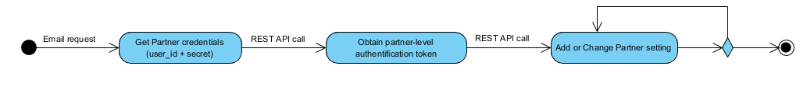

# Manage your Monite account

Monite is a SAAS that your backend securely sends and retrieves financial data to and from using a series of REST calls. In order to make authenticated REST calls to Monite, you need to create and manage your Monite account and API credentials. 

This page shows you how to set up your account and retrieve credentials.

## How it works

The following figure shows the workflow to create and manage your Monite account:



## What you need

To successfully set up and manage your Monite account, you need:

- Something
- Something else

## Setup a Monite account

In order to create a secure Monite account you need to send a email request to andrey@monite.com. In the response message you get a credential two pieces of data:
- user_id
- secret

This data is used to obtain a partner-level [authentification token](d.authentication.md). Keep it in secret as it provides an access to all data of the partner and associated entities.

## Retrieve your access token

As soon as you have your [credential](#setup-a-monite-account), you can make REST API call `POST /partner-api/api_users/v1/auth` to obtain a partner-level authentification token.

```curl
curl --location --request POST 'https://api.dev.monite.dev/partner-api/api_users/v1/auth' \
--header 'Content-Type: application/json' \
--data-raw '{
    "user_id": "your0000-user-id00-0000-000000000000",
    "secret": "your0000-secr-ret0-code-000000000000"
}'
```
The successful response code 200 OK contains the partner-level token which can be used in subsequent calls:
```json
{
    "token": "au-your0000-part-ner0-leve-access0token",
    "expiration_in": "2021-12-12T04:04:41.197124+00:00"
}
```
## Reference

TBD